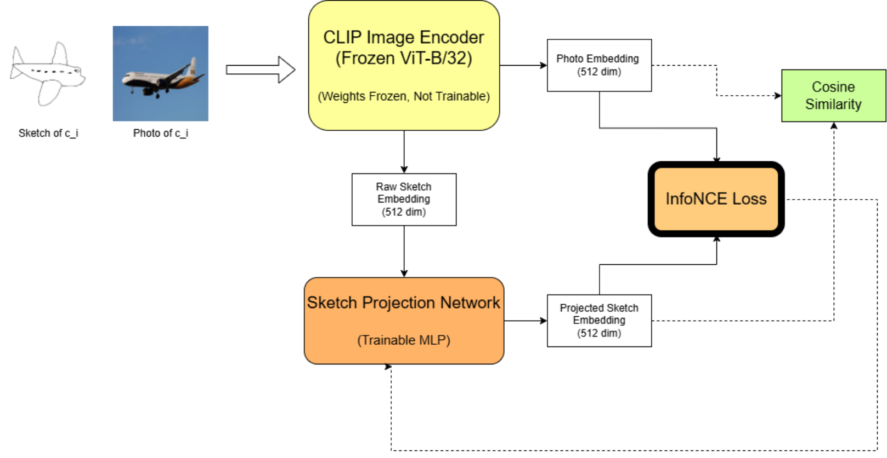

# Zero-Shot Sketch-Based Image Retrieval (ZS-SBIR) using Deep Learning

## Overview
This repository contains the implementation of a Zero-Shot Sketch-Based Image Retrieval (ZS-SBIR). The core objective of this project is to accurately retrieve relevant natural images using freehand sketch queries, with a specific focus on unseen categories that the model did not encounter during the training phase. This research was conducted as part of the Satyendra Nath Bose Summer Internship Program 2025 at the National Institute of Technology Silchar.

## How It Works
The architecture is designed to bridge the massive domain gap between abstract, sparse line sketches and rich, detailed natural photographs. 
*   **Base Encoder:** The system utilizes OpenAI's pre-trained CLIP (Contrastive Language-Image Pre-training) model as a frozen feature extractor to generate 512-dimensional baseline embeddings for both the sketches and the natural photos.
*   **Domain Adaptation:** To align the differing modalities, a custom deep neural network named `SketchProjectionNet` acts as a translator, projecting the raw sketch embeddings into a shared semantic space.
*   **Metric Learning:** The projection network is trained using InfoNCE loss, which is a contrastive loss function designed to pull sketch embeddings closer to their corresponding photo embeddings while pushing them away from dissimilar photos.
*   **Retrieval Engine:** For efficient real-world evaluation, gallery image embeddings are precomputed, and FAISS (Facebook AI Similarity Search) is utilized to rapidly find the nearest neighbor images for any given query.

<p align="center">
  <figure>
    
    <figcaption align="center"><b>Figure 1:</b> Overview of the Zero-Shot Sketch-Based Image Retrieval Pipeline</figcaption>
  </figure>
</p>

## Repository Structure
The project is organized into the following modular directory structure:

```text
├── assets/
│   └── architecture.png        # Pipeline architecture diagram
├── model/                      # Core machine learning models and scripts
│   ├── main.py                 # Main execution script
│   ├── requirements.txt        # Python dependencies
│   ├── setup.py                # Setup configuration
│   ├── notebooks/              # Jupyter notebooks for experimentation and prototyping
│   │   └── Category_Level_ZS_SBIR_Notebook.ipynb
│   └── src/                    # Source code for data pipelines, training, and evaluation
│       ├── data.py             # Data loading and PyTorch Dataset definitions
│       ├── split.py            # Script to generate zero-shot train/test category splits
│       ├── train.py            # Training loop for the SketchProjectionNet
│       ├── generate_gallery_embeddings.py # Precomputes CLIP embeddings for the image gallery
│       ├── eval_sketchy.py     # Evaluation script for the Sketchy dataset
│       └── eval_tuberlin.py    # Evaluation script for the TU-Berlin dataset
└── ui/                         # User interface components
